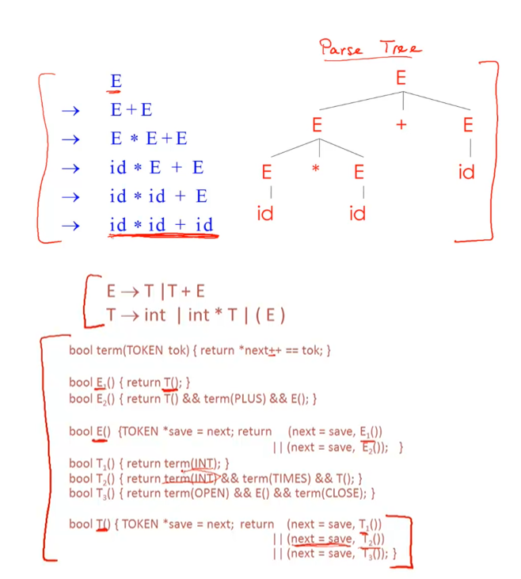
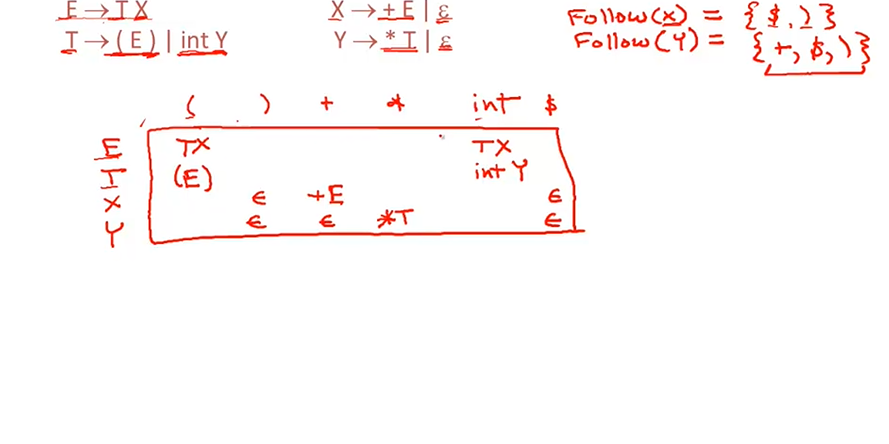
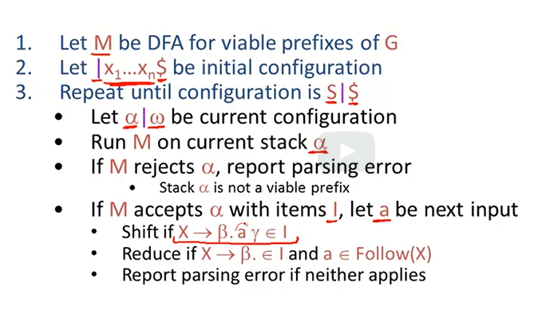
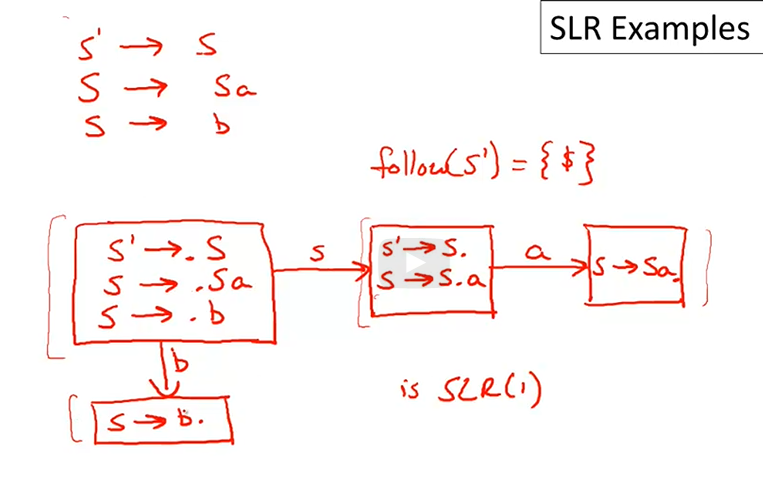
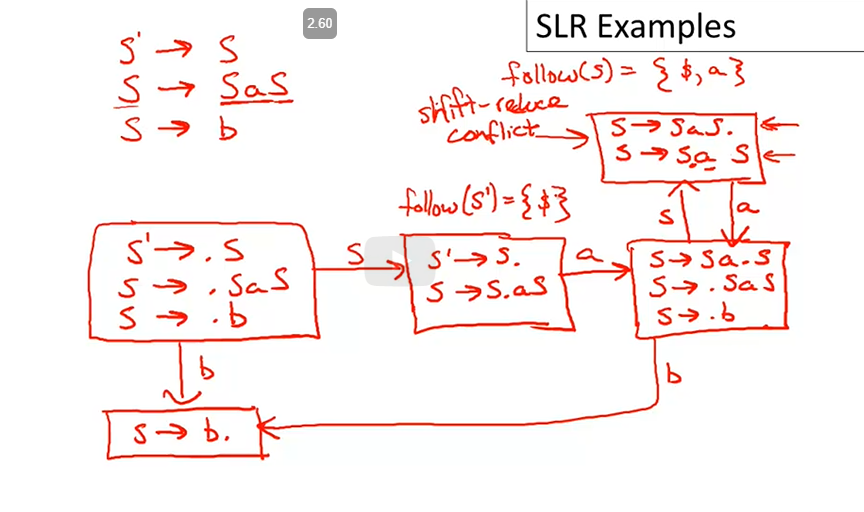

# Analise Semantica

## Introdução: Gramática livre de contexto

Linguagens de programação frequentemente usam recursos recursivos (definidos em termos de si mesmos), como o exemplo de *OP*, operações

10 + (5*2), em termos semânticos, é uma operação, composta de múltiplas expressões intermediárias

10 + ( 5 *2 ) => Operação (Soma, Numero(10), Operação (Multiplicação, Numero(5), Numero(2))

Como mostrado no exemplo, a operação pode ser composta por operações ou por números, o que faz ela ser impossível de ser modelada com a estrutura que vimos até agora, autômatos finitos, já que é necessária uma noção de "estado" para conseguir compreender o contexto semântico.

Para isso, iremos utilizar gramáticas livres de contexto, compostas por
* Conjunto de terminais, T
* Conjunto de não terminais, N
* Símbolo inicial, S, pertencente a N, geralmente a primeira produção
* Conjunto de produções, X -> Y1, Y2 ... Yn, 
    com x pertencendo a N 
    Yi podendo ser N, T ou {epsilon}
    e podendo ser entendidas como "regras de substituição"

1. Começar em S
2. Trocar um X não terminal pelo Yi da produção
3. Repetir até não termos não terminais, ou seja, apenas terminais

> inserir aqui exemplo legal ilustrado

Uma notação usada frequentemente é a da seta com asterisco em cima, significando que vai para a produção em 0 ou mais passos

Uma vez gerados, terminais são finais. Frequentemente são registrados em caps lock
Exemplo para a operação de antes

    E -> E + E
	    | E * E
	    | (E)
	    | id
A expressão será convertida até se tornar identificadores, virando id + (id*id) ao final da geração

No contexto de compiladores, não adianta saber se está na linguagem, porém _como_ aparece na linguagem, isto é, sua árvore de parse.
Vale notar que várias gramáticas geram a mesma linguagem, porém ferramentas de criação dependem da estrutura da gramática para funcionar de forma apropriada.

## Derivações

São aplicações sucessivas de produções nas regras de uma gramática, podendo ser representadas como uma árvore, com cada produção gerada sendo um filho do nó superior.

Para o exemplo abaixo, usaremos a string `id * id + id` e a gramática `E -> E + E | E* E | (E) id`

> inserir imagem

Importante notar que in-order travesal das folhas gera o input original, ou seja, navegar a árvore recursivamente, pelo filho esquerdo. Além disso, a parse tree mostra a associação de operadores, dando a prioridade desejada para cada operação. As folhas contém obrigatoriamente terminais, já que são o fim do parse naquele ramo.

### Deteccção de ambiguidade

Caso tenhamos, por exemplo, a gramática S -> SS | a | b, teremos ambiguidade, já que é possível gerar uma produção [a][ba] e outra [ab][b], ambas com resultados iguais mas um caminho diferente

Um jeito legal de lidar com ambiguidade impossibilitando uma gramática ambígua, enforçando a precedência de símbolos, com não terminais exclusivos para cada operação na ordem desejadada: Se fizermos uma regra E, exclusiva para adição, e outra E' para múltiplicação, podemos colocá-las de um jeito que a multiplicação sempre por último na árvore, ou seja, será a operação mais "interna" e transitivamente a operação executada primeira

Outra alternativa é associatividade e preferência, como no caso do E + E dizer que a operação de + é associativa a esquerda, ou seja, que tem mais preferência na árvore gerada para estar a esquerda

## Gerenciamento de erros
1. Panic mode
Quando um erro é encontrado a estratégia é recuar, descartando tokens, até um conhecido ser encontrado, continuando a partir de lá. Eles são chamados de tokens sincronizadores

2. Produção de erros
Adicionar formações na gramática que permite a utilização de termos "quase corretos", como 5x invés de 5*x

## Abstract Sintax Tree
Versão da Parse tree com operações redundantes removidas

## Top down

### Recursive descent parsing
Começar com o primeiro E não terminal, em ordem, esquerda pra direita, com backtracking em caso de erros, a serem detectados ao chegar num símbolo terminal, vendo se ele está correto.

Se um erro for encontrado, voltar para a produção anterior e repetir na ordem e, se nada der certo, subir mais um nível

Token = tipo dos tokens, como INT, OPEN, CLOSE, PLUS, 
Next é o ponteiro para o próximo token

Como fazer backtracking para todas as produções de um não terminal E?

bool E() {
TOKEN *save = next
return (next = save, E1() ) || (next = save, E2() );
}

Se retornar falso, o ponteiro next terá voltado para onde estava.

Bem trivial de implementar, só incluir tudo como booleanos de se tal produção funciona, promovendo backtrack se não for

#### Limitações

Não existe backtracking caso um não terminal seja reconhecido e seja necessário voltar, necessitando de um algoritmo mais genérico.

Podemos, entretanto, utilizar left factoring para reescrever a gramática e o algoritmo funcionar

### Left recursion

Quando uma gramática, como S-> Sa, tem um não terminal no começo, o algoritmo sempre vai falhar, já que vai ficar preso na recursão.
Uma solução é trocar o algoritmo para recursão pela direita, introduzindo um novo símbolo não terminal precedente

S -> Sa | b produz todas as strings que começam com um único b

Podemos fatorar o prefixo comum do estado inicial, em S -> b S'
e inserir a fatoração numa nova expressão
S' -> a S' | epsilon

reescrevendo com right recursion

Algoritmo para Left Factoring

Gramática E -> T + E | T
				   T -> int | int * T | (E)
Necessário refatorar para esquerda, de modo que dê para decidir o caminho a ser tomado baseado na informação do prefixo

    E -> T + E | T se torna 
    E -> TX, já que T é  o prefixo comum dos dois casos
    X -> + E | epsilon

Ainda falta o T, que sofre do mesmo problema de branching

    T -> int | int * T | (E) vira
    T -> int Y | (E)
    Y -> * T | epsilon (já usamos o prefixo int anteriormente)

## Parsing preditivo

Necessário gramática LL(k), ou seja

1. Left to right
2. left most derivation
3. k lookahead, geralmente = 1
Em linguagens LL(1) não é necessário backtracking, sabe-se que apenas um lookahead é suficiente, desde que a gramática seja left factored

Tabela de simbolos

Coluna 0 = símbolo não terminal mais a esquerda (atual)
Linha 0 = Próximo token de input, o k

O valor tabela[i][j] representa qual produção utilizar

Se não existe nada, é estado de erro

Possui uma pilha de registros da árvore de parse, com o topo da pilha sendo o terminal/nao terminal mais a esquerda. Terminais ainda não foram conferidos contra o input.

Caso stack vazia e fim do input, temos estado de aceitação

Começa vazia, com E -> S = <E$>
Se encontrar não terminal, remove o topo e puxa as novas produções
Se encontrar terminal, remove o topo e continua
Se sobrar não terminais, todas as produções devem ser epsilon

Exemplo:
Se encontrar ação TX, remove E e puxa TX, com S = <TX $>

Montar tabela

Função first e follow

## Bottom up

Fazemos o matching de produções de baixo pra cima, invertendo as produções até chegar no símbolo inicial E, com reduções

Ele faz uma derivação rightmost ao contrário

#### Funções first e follow

T[A, t] = α em dois casos

1. Se a->* t β, α deriva t na primeira posição, então t está no conjunto first(α)

2. Se A -> α e α ->* epsilon e S->* β A t Sigma

   Nesse caso a pilha tem A, entrada é t e não podemos derivar t
Derivaremos α de A, transicionando para t se ele está logo depois de A
Nesse caso t está no conjunto  follow(A)

### First

First(x) = {t | X -> * t α } U { epsilon | X ->* epsilon} 
Ou seja, se t aparece na primeira posição ou epsilon é produzido, temos first

Algoritmo 

1. Primeiro entram os terminais, já que eles produzem apenas eles mesmos, First(t) = {t}
2. epsilon está em first(X) se x -> epsilon ou se X produz algum não terminal que chegue em epsilon
3. First(α) está contido em First(X) se X -> A1... An α
   Ou seja, se você consegue fazer n produções A, todas com epsilon no conjunto first, α será gerável por X, logo seu conjunto first está dentro do de X. Uma hora você conseguirá igualdade com um conjunto de terminais e o contido é substituido por igualdade

### Follow

Follow(X) = {t | S ->* β X t Sigma }

Se X -> AB, então First(b) está contido em Follow(A), já que é o que vem depois, e Follow(X) está contido em Follow(B)
   Se B ->* epsilon, então Follow(X) es´ta contido em Follow(A)
  Nota:
$ sempre está no follow

Algoritmo

1. Inserir $ em Follow(S)
2. First(β) - {epsilon} está contido em Follow(X) para cada produção A-> α X β, já que o prefixo após um símbolo é o sufixo dele
3. Follow(A) está contido em Follow(X) para cada produção A-> α X β com epsilon contido em first(β) (caso em que o sufixo pode desaparecer)

Podemos fazer o algoritmo vendo o que vem de terminal, criando os "contidos" para os casos de prefixo, como X-> +E, logo follow(X) contém follow(E)

Se chegar num caso em que E -> TX e sabemos que epsilon é produzivel por x, podemos diretamente colocar o follow(E) contido no follow de (T)

Os follows de terminais são interessantes, já que usamos os firsts dos não terminais para o caso de estarem na esquerda e follow dos não terminais no outro caso. Necessário prestar atenção se epsilon é produzível em algum follow, se for é necessário usar as regras de antes

## LL1 Parsing tables

Para cada produção A -> α em G, com A sendo o não terminal mais da esquerda e t o novo token
Para cada terminal t em first(α) teremos T[A, t] = α
Se epsilon está em First(α), para cada t' em Follow(A) faça T[A, t'] = α
Se epsilon está em first(α) e $ está em Follow(A), teremos T[A, $] = α

No exemplo S -> Sa | b, ao construir, teremos first(S) = {b} e follow(S) = {$, a}

Na tabela em T[S, b] teremos {b, Sa}, multiplas definições não determinísticas 

1. Não fatorável pela esquerda
2. Recursiva pela direita
3. Ambígua ou com LL(k) com k>1
O unico jeito de verificar é criar a tabela e ver se tem multiplas entradas

### Shift reducer parser

Shift muda a barra pra direita, movendo um simbolo pra esquerda, dando push na  pilha de um terminal
Reduce aplica uma produção na lateral da barra, imediatamente a esquerda da barra, dando pop de simbolos da stack e pushd e não terminais

Shift reduce conflicts acontecem

### Handles

Queremos reduzir so se o caminho é reduzivel para um simbolo inicial
Além disso, eles só aparecem no topo da pilha

α é um prefixo válido se existe um ω tal que α | ω é o estado

Um prefixo válido é um que não se extende além do handle e, enquanto ele tiver prefixos válidos na pilha, nenhum erro de parsing foi detectado

Para qualquer gramática, o conjunto de prefixos viáveis é uma linguagem regular

Item: produção que tem um "." em algum lugar do rhs, com x->epsilon sendo x->.
   É chamado de item LR(0)

Iremos produzir todos os itens, o ponto é o separador do que foi visto e o que ainda não no handle

A stack é sempre p1 p2 p3 p_n, múltiplos prefixos do rhs

seja p_i um prefixo de rhs de x_i = α_i, então p_i eventualmente reduzirá para x_i, com a parte faltante de de α_i-1 começando com x_i

Logo, teremos x_i-1 -> p_i-1 x_i β para algum β, ou seja, teremos um pedaço já na pilha (p_i-1) , com x_i extendendo esse prefixo com o rsesto em β

Recursivamente, todos os prefixos p_k+1 até p_n reduzirão para a parte faltante de a_k

Cada rhs parcial pode eventualmente reduzir para parte do sufixo faltando do seu predecessor

### Reconhecendo handles

1. Criar uma transição S' -> S na gramática representando o começo
2. Criar um NFA que os estados são os itens de G, incluindo a produção extra
3. Para cada idem E-> α . X β (α na pilha e X β na direita adicionar transição do ponto, isto é, se ele ler X avança pro proximo item
4. Em itens E -> α . X β, com X sendo não terminal, e tiver uma transição x-> γ, vamos criar uma transição epsilon no automato para X-> . γ (ou seja, vamos tentar reconhecer outro prefixo válido)
5. Todo estado é de aceitação e S' -> S é o inicial

Caso um estado já existente seja encontrado, como o início (. no começo) de um não terminal, ligamos no automato

#### Itens válidos

Os estados do DFA são a coleção canônica de itens ou de itens LR(0)
Ao converter o NFA para DFA o estado de aceitação será o artificial criado, S' -> S. Se chegar nele acabou.
O item X -> β . γ é valido para um prefixo de α β se
S' ->* α X ω -> α β γ ω por uma derivação da direita

Depois do parse de α β, os itens válidos são o topo da pilha

### Parsing de SLR (Simple LR)

Se Lr(0) assumimos que pilha tem α, proxima entrada é t e o DFA para uma entrada α termina no estado s

* Reduziremos para x-> β se s contem item X->β .
   Se for SLR e tivermos conflito, só fazemos a redução se o símbolo seguinte, t, está em follow(X). Equivale a dizer que só podemos reduzir se o símbolo seguinte ocorrer depois do reduzido na gramática
* Shift se s contém item x-> β . t ω, equivalente se s tem uma transição t
   Se for SLR, só fazemos o shift se t for uma transição viável. Senão um erro de parse é emitido
  
Existem conflitos de reduce reduce (qual reduce usar) e shift reduce (não saber se reduz ou faz shift) se os estados tiverem itens para os dois.

#### Preferências

Uma alternativa é declarar precedência entre conflitos, de modo que a indecisão shift/reduce seja sempre resolvível em gramáticas ambíguas

### Melhoras no parse SLR

Uma melhora possível é lembrar o estado do DFA e calcular a variação, incluindo na pilha <simbolo, estado>

* Ao fazer um shift k: push do novo estado da pilha (ponteiro aumentando) e o estado k
* Ao fazer um reduce x->a
Remover da pilha o par A
push X, goto[top_state(stack), X]

A tabela goto armazena as transições do DFA

### Parse LR(1)

Para fazer isso incluimos o lookahead nos itens! O item vira um par, com o item atual e o lookahead em seguida